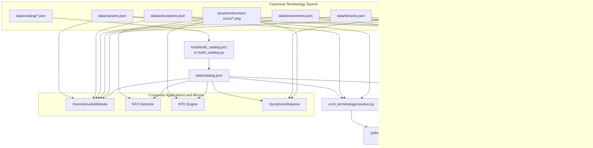

# OwnLife Audio Terminology

Canonical terminology data and deterministic alias-resolution support shared by OwnLife Audio tools.

## Status

The first implementation slice is available: canonical seed data, JSON schemas, a deterministic Python resolver, validation tooling, and a generated distribution/sync pipeline for runtime consumers.

## Repository layout

- `data/` — authoritative terminology JSON files, including the generated `catalog.json`
- `data/instrument-properties.json` — canonical per-instrument pitch and loudness-reference properties for `orch.db` consumers such as SymphonicBalance
- `data/catalog/` — per-library catalog source files that are combined into `catalog.json`
- `assets/instrument-icons/` — canonical instrument icon PNGs keyed by `iconKey` from `data/instruments.json`
- `schema/` — JSON Schema definitions
- `tests/` — resolver and validation fixtures
- `tools/` — validation and generation tooling

Applications such as NTD Engine and NTD Detector must consume this repository's data rather than maintaining independent terminology sources. Applications that need canonical instrument pitch or loudness-reference metadata, such as SymphonicBalance, must consume the generated `orch.db` representation of `instrument-properties.json` rather than creating an independent authority. Instrument icon PNGs are also canonical here under `assets/instrument-icons/`; NtdEngine currently consumes that icon set at runtime, while other consumers should mirror it only if they actually render instrument icons.



## Editing terminology data

Edit the canonical JSON files in `data/` and the canonical instrument PNGs in `assets/instrument-icons/`. The copies in consuming applications are mirrors and can be overwritten during synchronization when those consumers actually need the icon assets.

For catalog relationships, edit the per-library source files in `data/catalog/` and then run `pwsh -File tools/build_catalog.ps1` to regenerate the aggregate `data/catalog.json`.

Keep entity IDs stable because libraries and `contexts.json` reference them directly. Aliases/abbreviations must never contain whitespace; use hyphens instead. Alias order matters: the first alias is used as the default abbreviation in the website's clipboard string. Avoid alias collisions within a category and preserve `schemaVersion: 1`. Each instrument `iconKey` identifies its preferred PNG in `assets/instrument-icons/`; consumers must fall back to `default.png` when that file is unavailable.

The canonical vocabulary now includes `variants.json` for optional articulation qualifiers. Use `variant` as a separate normalized field rather than folding qualifiers back into `articulation`.

`instrument-properties.json` is keyed by instrument ID from `instruments.json`. It currently supports pitch range, recommended measurement range, and factory loudness-reference targets for `long` and `short` capture modes. Treat it as canonical source data that is exported into `orch.db` for consumer applications.

After editing, validate the data, rebuild the runtime distribution, and run the tests:

```powershell
python tools/build_distribution.py
python -m unittest discover -s tests
```

## Checks

From the repository root:

```powershell
python tools/build_distribution.py --skip-sync
python -m unittest discover -s tests
```

The resolver normalizes separators and case, prefers contextual aliases, supports longest-match filename parsing, and reports unresolved or ambiguous terms explicitly. It also resolves optional articulation variants when they are present in the canonical vocabulary.
